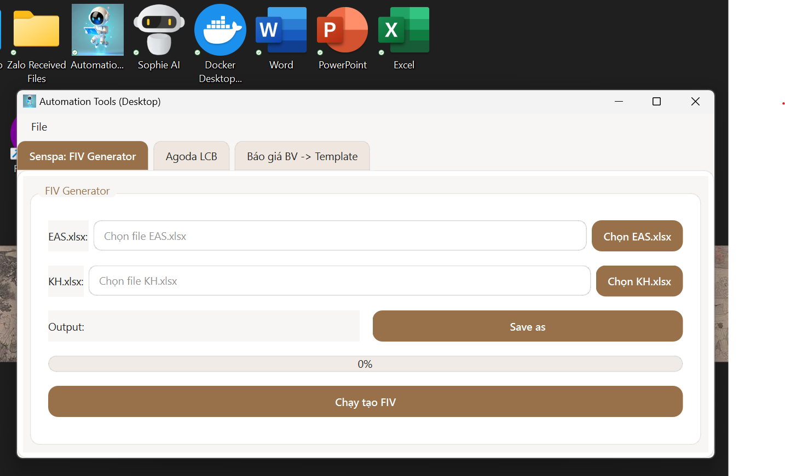
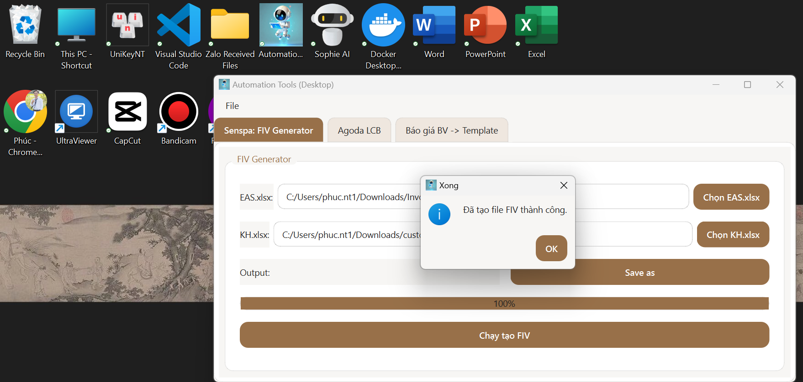
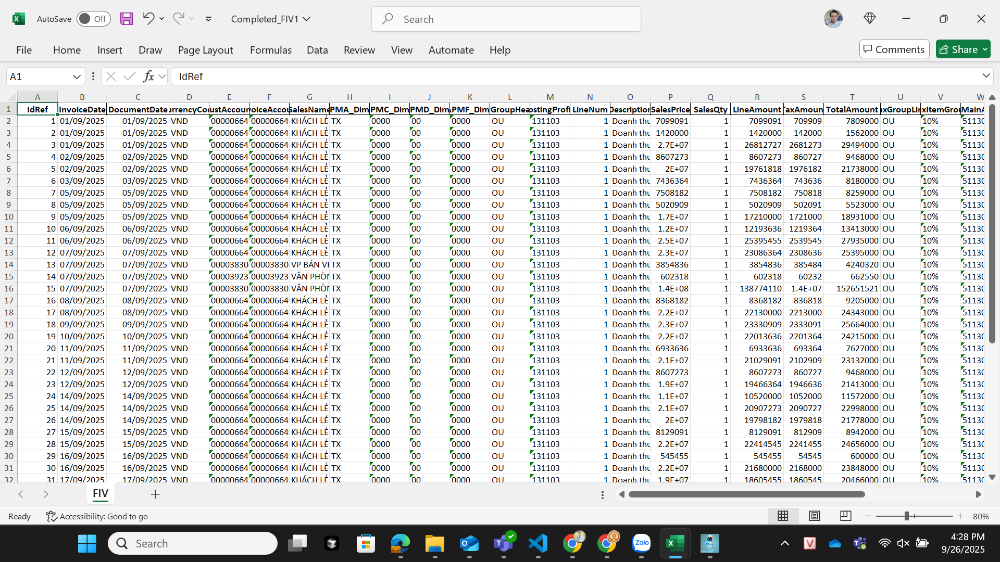

# 🚀 Automation Tools for Data Processing

Ứng dụng **Automation Tools** giúp tự động hóa quá trình xử lý dữ liệu từ Excel và chuyển đổi trực tiếp vào hệ thống **AX**.  
Với giao diện thân thiện, chỉ vài thao tác click chuột là bạn có thể rút ngắn thời gian nhập liệu thủ công từ hàng giờ xuống chỉ còn vài phút.

---

## ✨ Tính năng chính
- 📝 **Nhập dữ liệu từ Excel** nhanh chóng.  
- ⚡ **Tự động xử lý & chuẩn hóa dữ liệu** trước khi đưa vào hệ thống.  
- 🔄 **Xuất kết quả** và hiển thị trực quan.  
- 🖥️ Giao diện thân thiện, dễ sử dụng, không cần kỹ năng lập trình.  

---

## 📸 Giao diện ứng dụng

### Màn hình chính khi mở app


### Ứng dụng đang xử lý dữ liệu


### Kết quả sau khi xử lý

---

## 🛠️ Cách sử dụng
1. **Chuẩn bị dữ liệu Excel** theo template (ví dụ: `input_data.xlsx`).  
2. Mở ứng dụng `AutomationTools.exe`.  
3. Chọn file Excel cần xử lý.  
4. Nhấn **Run** để hệ thống tự động chạy và xử lý dữ liệu.  
5. Xem kết quả xuất ra trực tiếp trên giao diện hoặc file output.  

---

## 📦 Cài đặt
1. Clone repo về máy:
   ```bash
   git clone https://github.com/Phuc75nguyen/AutoData4FA.git
   cd AutoData4FA

2. Cài đặt môi trường ảo
   ```bash
    python -m venv venv
    venv\Scripts\activate
    pip install -r requirements.txt
     Chạy ứng dụng:  python app_gui.py

---
### Make with Ton of Love (Tan Phuc)


